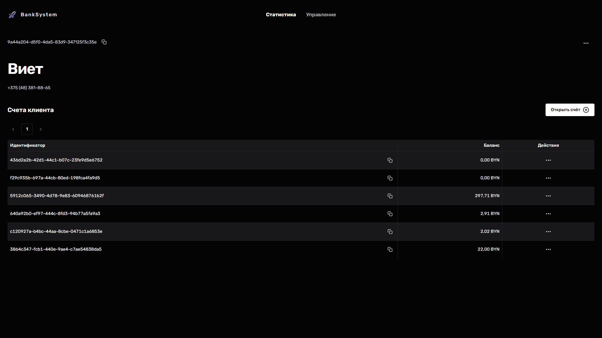
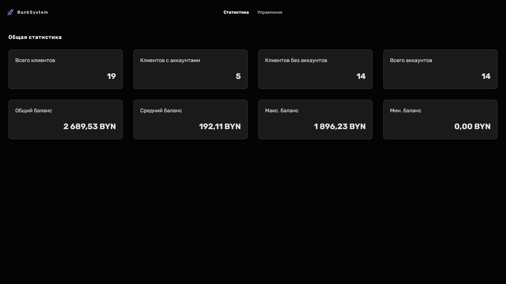
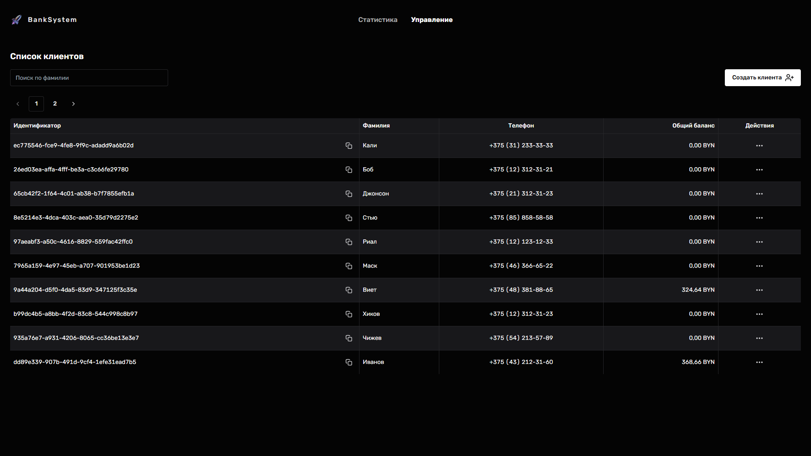

# 🏦 BankSystem

<div align="center">


**Учебный проект банковской системы с полноценным Backend и Frontend**

*RESTful API на Spring Boot + современный SPA интерфейс на React*

[🚀 Быстрый старт](#-быстрый-старт) • [📚 Документация](#-документация) • [🏗️ Архитектура](#️-архитектура) • [📸 Скриншоты](#-скриншоты)

</div>

---

## 📋 О проекте

**BankSystem** — это **учебный проект** полноценной банковской системы, состоящий из серверной части (Backend) на Spring Boot и клиентской части (Frontend) на React. Проект создан в образовательных целях для изучения современных технологий веб-разработки, архитектуры приложений и практик DevOps.

> ⚠️ **Важно:** Этот проект создан исключительно для образовательных целей и обучения технологиям разработки. Он не предназначен для использования в production среде или для реальных банковских операций.





### ✨ Основные возможности

- 👥 **Управление клиентами** — создание, редактирование, удаление клиентов банка
- 💰 **Управление счетами** — создание счетов, пополнение, снятие средств
- 🔄 **Переводы между счетами** — переводы с автоматическим начислением комиссии
- 📊 **Статистика** — общая статистика по системе (количество клиентов, счетов, сумма балансов)
- 🔍 **Поиск и фильтрация** — поиск клиентов по фамилии с пагинацией
- 📖 **API документация** — Swagger/OpenAPI для всех endpoints
- 🎨 **Современный UI** — адаптивный интерфейс с поддержкой темной/светлой темы

---

## 📸 Скриншоты

<div align="center">

### 🏠 Главная страница (Dashboard)


*Общая статистика системы: количество клиентов, счетов и сумма всех балансов*

### 👥 Список клиентов


*Управление клиентами с поиском и пагинацией*

### 📋 Детали клиента


*Детальная информация о клиенте и его счетах с возможностью операций*

</div>

> 💡 **Примечание:** Поместите скриншоты приложения в директорию `docs/images/` с именами:
> - `dashboard.png` — главная страница
> - `clients.png` — страница списка клиентов  
> - `client-details.png` — страница деталей клиента

---

## 🏗️ Архитектура

Проект состоит из трех основных компонентов, работающих в Docker-контейнерах:

```
┌─────────────────────────────────────────┐
│         Client (React SPA)              │
│    Nginx → Порт: 3000 (публичный)       │
│    Проксирует /api → Server:8080        │
└─────────────────┬───────────────────────┘
                  │ HTTP/REST API (внутри Docker сети)
┌─────────────────▼───────────────────────┐
│      Server (Spring Boot)               │
│    Порт: 8080 (только внутри сети)      │
└─────────────────┬───────────────────────┘
                  │ JDBC
┌─────────────────▼───────────────────────┐
│      PostgreSQL Database                │
│    Порт: 5432 (только внутри сети)      │
└─────────────────────────────────────────┘
```

### 🔒 Безопасность

- **Сервер и БД не экспортируются наружу** — доступны только внутри Docker сети
- **Клиент проксирует запросы** — все API запросы идут через nginx на клиенте
- **CORS настроен** — разрешены запросы только с `http://localhost:3000`

### 📁 Структура проекта

```
BankSystem/
├── server/              # Backend (Spring Boot)
│   ├── src/            # Исходный код Java
│   ├── Dockerfile      # Docker образ для сервера
│   └── README.md       # Документация сервера
├── client/             # Frontend (React + TypeScript)
│   ├── src/            # Исходный код React
│   ├── Dockerfile      # Docker образ для клиента
│   ├── nginx.conf      # Конфигурация nginx (проксирование API)
│   └── README.md       # Документация клиента
├── docs/                # Документация и изображения
│   └── images/         # Скриншоты приложения
├── docker-compose.yml  # Оркестрация всех сервисов
└── README.md           # Главная документация (этот файл)
```

---

## 🚀 Быстрый старт

### Предварительные требования

- 🐳 **Docker** и **Docker Compose** (рекомендуется)
- Или отдельно: Java 21+, Node.js 18+, PostgreSQL 15+

### 🐳 Запуск через Docker Compose (рекомендуется)

Самый простой способ запустить весь проект одной командой:

```bash
# Клонируйте репозиторий
git clone https://github.com/vovgoo/BankSystem.git
cd BankSystem

# Запустите все сервисы
docker-compose up -d

# Проверьте статус
docker-compose ps
```

После запуска (обычно 1-2 минуты):
- 🌐 **Frontend**: http://localhost:3000
- 📖 **Swagger UI**: доступен через клиент по адресу http://localhost:3000/api/swagger-ui.html

> ⚠️ **Важно:** Сервер и база данных не экспортируются наружу для безопасности. Все запросы к API идут через клиент (nginx проксирует `/api` → `server:8080`).

### 🐳 Запуск с готовыми образами из Docker Hub

Вы также можете использовать готовые образы из Docker Hub без локальной сборки:

```bash
# Запустите PostgreSQL
docker run -d \
  --name banksystem-postgres \
  -e POSTGRES_DB=BankSystem \
  -e POSTGRES_USER=vovgoo \
  -e POSTGRES_PASSWORD=StrongestLocalPassword \
  -p 5432:5432 \
  postgres:15-alpine

# Запустите сервер (порт не экспортируется, только для примера)
docker run -d \
  --name banksystem-server \
  --network host \
  -e SPRING_DATASOURCE_URL=jdbc:postgresql://localhost:5432/BankSystem \
  -e SPRING_DATASOURCE_USERNAME=vovgoo \
  -e SPRING_DATASOURCE_PASSWORD=StrongestLocalPassword \
  -e CORS_ALLOWED_ORIGINS=http://localhost:3000 \
  vovgoo/banksystem-server:latest

# Запустите клиент
docker run -d \
  --name banksystem-client \
  -p 3000:80 \
  --network host \
  vovgoo/banksystem-client:latest
```

> ⚠️ **Важно:** При использовании готовых образов убедитесь, что сервер и клиент находятся в одной Docker сети или используйте `--network host` для всех контейнеров.

**Готовые образы:**
- 🐳 `vovgoo/banksystem-server` — серверная часть
- 🐳 `vovgoo/banksystem-client` — клиентская часть

### 🔧 Локальная разработка

Для разработки можно запускать компоненты отдельно:

#### Запуск сервера

```bash
cd server
./gradlew bootRun
```

Сервер будет доступен на http://localhost:8080

Подробнее в [документации сервера](./server/README.md).

#### Запуск клиента

```bash
cd client
yarn install
yarn dev
```

Клиент будет доступен на http://localhost:5173

> 💡 **Примечание:** Для локальной разработки создайте файл `client/.env` с `VITE_API_URL=http://localhost:8080`

Подробнее в [документации клиента](./client/README.md).

---

## 📚 Документация

### 📖 Подробная документация

- **[Server README](./server/README.md)** — документация серверной части
  - Архитектура и структура проекта
  - API документация (Swagger)
  - Настройка и запуск
  - Тестирование

- **[Client README](./client/README.md)** — документация клиентской части
  - Архитектура и структура проекта
  - UI компоненты и страницы
  - Настройка и запуск
  - Оптимизация производительности

### 🔌 API Endpoints

Основные endpoints API:

- **Клиенты**: `/api/v1/clients`
  - `GET /api/v1/clients/search` — поиск клиентов
  - `GET /api/v1/clients/{id}` — получить клиента
  - `POST /api/v1/clients` — создать клиента
  - `PUT /api/v1/clients` — обновить клиента
  - `DELETE /api/v1/clients/{id}` — удалить клиента

- **Счета**: `/api/v1/accounts`
  - `POST /api/v1/accounts` — создать счет
  - `POST /api/v1/accounts/deposit` — пополнить счет
  - `POST /api/v1/accounts/withdraw` — снять средства
  - `POST /api/v1/accounts/transfer` — перевод между счетами
  - `DELETE /api/v1/accounts/{id}` — удалить счет

- **Статистика**: `/api/v1/stats`
  - `GET /api/v1/stats` — общая статистика системы

Полная интерактивная документация доступна в Swagger UI: http://localhost:3000/api/swagger-ui.html (через клиент)

---

## 🛠️ Технологический стек

### Backend
- **Java 21** — современная версия Java с новыми возможностями
- **Spring Boot 3.5.7** — фреймворк для создания приложений
- **Spring Data JPA** — работа с базой данных через ORM
- **PostgreSQL 15** — надежная реляционная база данных
- **Liquibase** — управление миграциями БД
- **Swagger/OpenAPI** — автоматическая документация API
- **Gradle** — система сборки и управления зависимостями

### Frontend
- **React 19.1** — библиотека для создания UI
- **TypeScript 5.9** — типизированный JavaScript для надежности
- **Vite 7.1** — быстрый сборщик с HMR
- **Chakra UI 3.28** — современная библиотека UI компонентов
- **React Query 5.90** — управление состоянием и кеширование
- **Zod 4.1** — типобезопасная валидация схем
- **Axios** — HTTP клиент для работы с API
- **Tailwind CSS 4.1** — utility-first CSS фреймворк

### DevOps
- **Docker** — контейнеризация приложений
- **Docker Compose** — оркестрация сервисов
- **Nginx** — веб-сервер для статики и проксирования API

---

## 🧪 Тестирование

### Backend тесты
```bash
cd server
./gradlew test
```

### Frontend тесты
```bash
cd client
yarn test
```

---

## 📝 Лицензия

Этот проект распространяется под лицензией MIT. См. файл `LICENSE` для подробностей.

---

## 👨‍💻 Автор

**vovgoo**

- GitHub: [@vovgoo](https://github.com/vovgoo)

---

<div align="center">

**🎓 Учебный проект для изучения современных технологий веб-разработки**

⭐ Если проект помог вам в обучении, поставьте звезду!

[📖 Server Docs](./server/README.md) • [📖 Client Docs](./client/README.md)

</div>
